# Blazor Web Assembly

## Sequence Diagram

```mermaid
sequenceDiagram

participant C as Client (Browser)
participant S as Server

  

C->>S: 1. Initial page request (HTML + Blazor WASM files)
S-->>C: 2. Return HTML + DLLs + .NET runtime (WASM)
C->>C: 3. Load and initialize .NET runtime in browser
C->>C: 4. Render UI locally (no server rendering)

  

Note over C,S: Later – user interacts with UI (e.g., clicks button)

  

C->>C: 5. Handle event in browser (.NET code runs in WASM)
C->>S: 6. Optional API call (fetch data, etc.)
S-->>C: 7. Return JSON/data
C->>C: 8. Update UI in browser (no reload, no SignalR)
```



## 🧩 Blazor Web Assembly


- `UserList.razor`

```html
@page "/users"

<h3>User List</h3>

<ul>
@foreach (var user in Users)
{
    <li>@user</li>
}
</ul>

<button @onclick="Reload">Refresh</button>

@code {
    List<string> Users = new() { "Alice", "Bob" };

    void Reload()
    {
        // in a real app you could reload from DB or service
        Users = new() { "Alice", "Bob", "Charlie" };
    }
}
```
