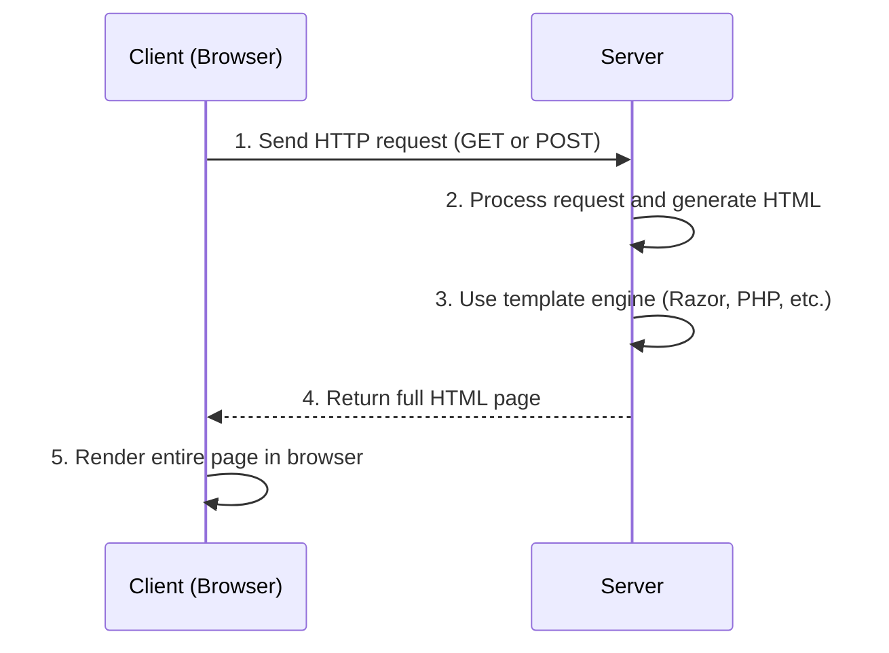

# SSR (Server Side Rendering)

## Sequence Diagram



## 🧩 C# (Razor MVC)

- HTML (`Index.cshtml`)
```html
<h1>User List</h1>

<ul>
@foreach (var u in Model)
{
    <li>@u</li>
}
</ul>
```

- C# (`HomeController.cs`)
```cs
public IActionResult Index()
{
    var users = new[] { "Alice", "Bob" };
    return View(users); // Rendering full page (SSR)

```

- HTML (`List.cshtml`)

```html
<ul><li>Alice</li><li>Bob</li></ul>
```
