# SSR with Partial Rendering (AJAX)

## Sequence Diagram

```mermaid
sequenceDiagram

participant C as Client (Browser)

participant S as Server

  

C->>S: 1. Initial page request (full HTML)

S-->>C: 2. Return complete HTML page

C->>C: 3. Render page in browser

  

Note over C,S: Later – user interacts (e.g., updates a section)

  

C->>S: 4. AJAX request for a fragment

S->>S: 5. Render partial view / HTML fragment

S-->>C: 6. Return partial HTML (only the updated section)

C->>C: 7. Replace fragment in DOM (no full reload)
```




## 🧩 C# (Razor MVC)

- HTML (`Index.cshtml`)
```html
<div id="box">@await Html.PartialAsync("_List")</div>
<button onclick="reload()">Refresh</button>

<script>
function reload() {
  fetch('/Home/List').then(r => r.text())
    .then(html => box.innerHTML = html);
}
</script>
```

- C# (`HomeController.cs`)
```cs
using Microsoft.AspNetCore.Mvc;

public class HomeController : Controller
{
    public IActionResult Index()
    {
        var users = new[] { "Alice", "Bob" };
        return View(users); // full page SSR
    }

    public IActionResult List()
    {
        var users = new[] { "Alice", "Bob" };
        return PartialView("_List", users); // Partial render (AJAX)
    }
}
```

- HTML (`List.cshtml`)

```html
<ul>
  <li>Alice</li>
  <li>Bob</li>
</ul>
```
